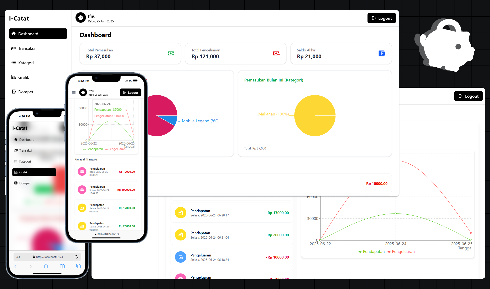

# I-Catat

I-Catat adalah aplikasi pencatatan keuangan berbasis web yang memudahkan pengguna untuk mencatat pemasukan, pengeluaran, serta memantau grafik keuangan secara real-time. Aplikasi ini dirancang responsif dan dapat diakses melalui desktop maupun perangkat mobile.

## Fitur Utama

- **Dashboard**: Ringkasan pemasukan, pengeluaran, dan saldo akhir.
- **Transaksi**: Catat pemasukan dan pengeluaran dengan mudah.
- **Kategori**: Kelola kategori transaksi sesuai kebutuhan.
- **Grafik**: Visualisasi data keuangan dalam bentuk grafik dan diagram.
- **Dompet**: Manajemen dompet dan anggaran.

## Tampilan Aplikasi



## Teknologi

- **React** + **Vite** untuk pengembangan frontend.
- **Chart.js** atau library sejenis untuk visualisasi data.
- **Responsive Design** untuk tampilan optimal di berbagai perangkat.

## Cara Menjalankan

1. Clone repository ini:
   ```bash
   git clone https://github.com/ifnuu01/Pencatatan-Keuangan.git
   ```
2. Masuk ke folder project:
   ```bash
   cd fe-pencatatan-keuangan
   ```
3. Install dependencies:
   ```bash
   npm install
   ```
4. Jalankan aplikasi:
   ```bash
   npm run dev
   ```
5. Buka di browser pada `http://localhost:5173`

&copy; 2025 Ifnu Umar
